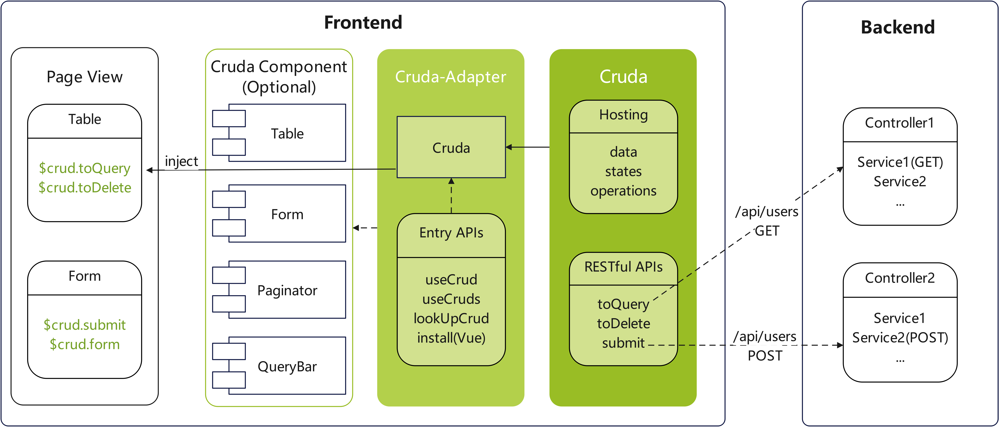
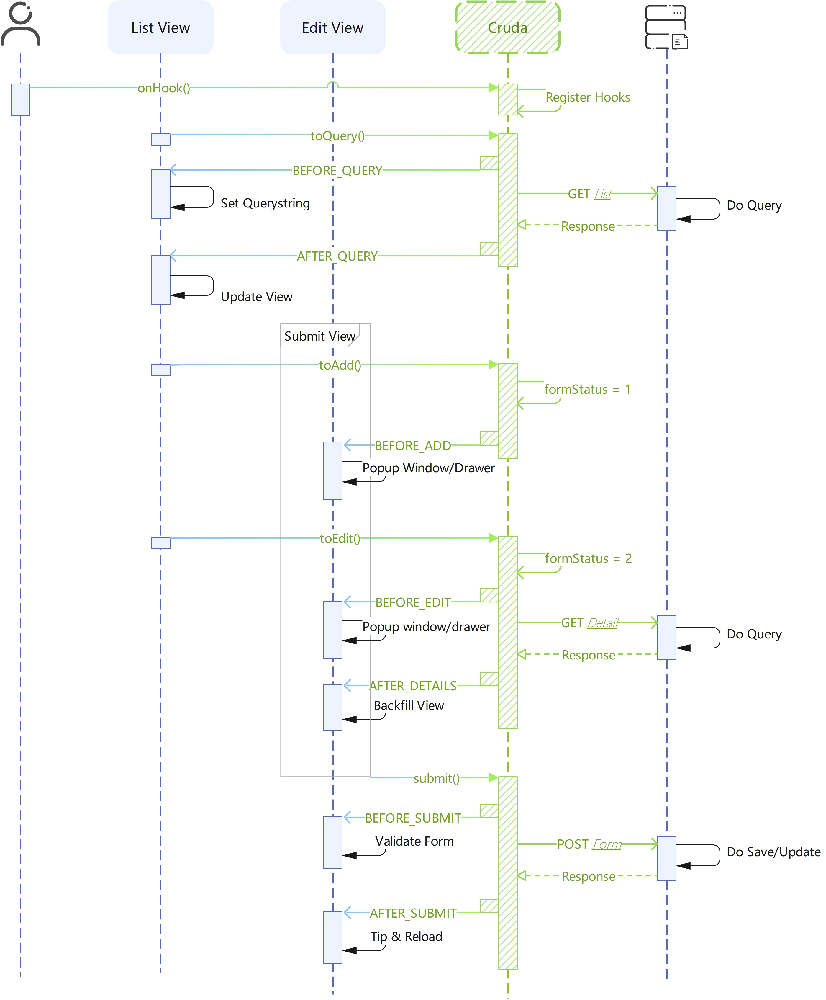

#  Cruda


A CRUD view model provides hosting of data, states and operations like `submit()`/`form.name`/`loading.table`, which makes developers build CRUD view faster.

Cruda provides unified APIs for different UIFrameworks by Cruda-adapters.

## Conception


## Demos
- [element-ui](https://stackblitz.com/edit/cruda-element-ui?file=src%2FApp.vue)
- [element-plus](https://stackblitz.com/edit/cruda-element-plus?file=src%2FApp.vue)

## Features
- Data hosting
```html
<!-- $crud.query (query data hosting) -->
<el-input v-model="$crud.query.xxx"></el-input>
<!-- $crud.table.data (table data hosting) -->
<el-table v-model="$crud.table.data"></el-table>
<!-- $crud.form (form data hosting) -->
<el-form :model="$crud.form"></el-form>
<!-- $crud.table.data (tree data hosting) -->
<el-tree :model="$crud.table.data"></el-tree>
```
- Operation hosting
```js
$crud.submit(formEl) //submit form
$crud.reload() //reload table 
$crud.cancel() //cancel form
```
- State hosting
```html
<!-- loading.query will be set automatically when reload() is called -->
<button class="..." :loading="$crud.loading.query" @click="$crud.reload()">
  查询
</button>
```
- Logical encapsulation
```js
/* when you call the toQuery(), Cruda will
1. set loading.query to True
2. package query, pagination, order, ...
3. emit hooks
4. catch exceptions
5. ...
*/
$crud.toQuery()
```
- RESTful HTTP Method
```js
$crud.toQuery() //GET
$crud.toDelete() //DELETE
$crud.doUpdate() //PUT
```
- UIFrameworks supports
- Multi-instance supports
- ...

## Usage
### 1. Install
- [cruda-adapter-element-ui](https://github.com/holyhigh2/cruda-element-ui)
- [cruda-adapter-element-plus](https://github.com/holyhigh2/cruda-element-plus)
### 2. Activate
- [cruda-adapter-element-ui](https://github.com/holyhigh2/cruda-element-ui)
- [cruda-adapter-element-plus](https://github.com/holyhigh2/cruda-element-plus)
### 3. Multi-instance
- [cruda-adapter-element-ui](https://github.com/holyhigh2/cruda-element-ui)
- [cruda-adapter-element-plus](https://github.com/holyhigh2/cruda-element-plus)
### 4. Hooks
- [cruda-adapter-element-ui](https://github.com/holyhigh2/cruda-element-ui)
- [cruda-adapter-element-plus](https://github.com/holyhigh2/cruda-element-plus)
### 5. Custom component
- [cruda-adapter-element-ui](https://github.com/holyhigh2/cruda-element-ui)
- [cruda-adapter-element-plus](https://github.com/holyhigh2/cruda-element-plus)
### 6. URL params
- [cruda-adapter-element-ui](https://github.com/holyhigh2/cruda-element-ui)
- [cruda-adapter-element-plus](https://github.com/holyhigh2/cruda-element-plus)
### 7. Global defaults
You can set global defaults of Cruda if all scenes have the same behavior in your project. 
```ts
//what properties does 'rs' have depends on the backend return value
CRUD.defaults[CRUD.HOOK.AFTER_QUERY] = function (crud, rs) {
  crud.pagination.total = rs.data.total
  crud.table.data = rs.data.records || []
}
CRUD.defaults.pagination.pageSize = 10
CRUD.defaults.view.opQuery = true
CRUD.defaults.table.rowKey = 'id'
```
### 8. RESTAPI
You can modify the URL/Method to adapt to the backend service
```js
CRUD.RESTAPI = {
  QUERY: { url: "", method: "GET" },
  ADD: { url: "", method: "POST" },
  UPDATE: { url: "", method: "PUT" },
  DELETE: { url: "", method: "DELETE" },
  EXPORT: { url: "/export", method: "GET" },
  IMPORT: { url: "/import", method: "POST" },
  SORT: { url: "/sort", method: "PUT" },
  COPY: { url: "/copy", method: "POST" },
}
```
#### Instance API (v1.9+)
Or set instance-only API when Activation
```js
const $crud = useCrud({
  url:'/api/single',
  restApi:{
    //支持对象格式或字符串格式(仅能设置url)
    ADD:{url:'/add-batch',method:'POST'},
    COPY:'/copy2'
  }
})
```
>**\*** Note the api key must be uppercase
### 9. xApi (v1.5+)
`CRUD.xApi(apiName, apiUrl, config)` is used to extend custom CRUD RESTAPI. Below is an example
```js
//1. Extends an API. After that it will
/**
 * a. Attach a method 'toClone' to the CRUD instance
 * b. Add 'BEFORE_CLONE' and 'AFTER_CLONE' to CRUD.HOOK
 */
CRUD.xApi('clone','/clone',{method:'POST'})
//2. Add listener
onHook(this,CRUD.HOOK.AFTER_CLONE,(crud,rs)=>{
  console.log('xApi-->',rs.data)
})
//3. Call toClone
this.$crud.toClone({x:1,y:2});
```
### 10. Auto Response (v1.8+)
We can config `autoResponse` to refresh table view automatically, this could help you to avoid losing page state if you `reload()` the page after add/update/delete/copy submition before. A typical case is you may lost all hierarchies of TreeTable you opened before when you `reload()`.Below is the config
```ts
//1. Set a response validator to check whether the response is valid
$crud.autoResponse.validator = (response:{status:number})=>{
  return response.status === 200
}
//2. For such an Add-Oper like add/copy/import/..., it must set a getter in order to obtain new records with primary key from backend
CRUD.defaults.autoResponse.getter = (response:any)=>{
  return [response.data]
}
//2. If primary keys are generated at frontend, you can either return submitRows
CRUD.defaults.autoResponse.getter = (response:any,submitRows?:any[])=>{
  return submitRows
}
//3. For TreeTable, you need set parentKeyField in order to find parentNode
CRUD.defaults.autoResponse.parentKeyField = 'pid'
```
After that, the table view will refreshed by CRUDA. And if you want to refresh manually you can call `autoProcess()` in the hook below
```ts
// Other hooks which can invode autoProcess please see the doc below 
onHook(CRUD.HOOK.AFTER_DELETE,(crud,rs,rows,autoProcess)=>{
  autoProcess()
})
```

## Cruda API
### VM
- view ✅
  > Display switch of Components
  >
  > - opQuery
  > - opAdd 
  > - opEdit 
  > - opDel 
  > - opExport 
  > - opImport
  > - opSort
  > - opCopy
- loading
  > Toggle loading state
  >
  > - query 
  > - table 
  > - del 
  > - submit 
  > - form 
  > - export 
  > - import 
  > - sort 
  > - copy 
- query
  > Query data container
- sortation
  > Sort data container
- table
  > Table data container
  >
  > - data 
  > - selection 
  > - allColumns 
  > - orders 
  > - rowKey✅
- pagination
  > Pagination container
  >
  > - pageSize✅ 
  > - currentPage 
  > - total 
- form
  > Form data container
- formStatus
  > form state. 0：Normal；1：Add；2：Edit；3：View
- params
  > crud active params
- error
  > crud error msg{name，message，status}
- editingId
  > editing id of the `table.row`
- key
  > crud key in multi-instance
- recoverable✅
  > enable/disable editing snapshot
- snapshots
  > snapshot map. The key is `table.row[rowKey]`
- invalidBreak✅
  > will break the validation after first catch
- autoResponse✅
  > will update table view automatically after you add/update/delete/copy `crud.table.data`

✅ **_Indicates that global defaults are supported_**

### Methods

- toQuery(query?: Record<string, any>) : Promise
  > Instance query. Send GET request to the backend。The argument 'query' will [merge](https://holyhigh2.github.io/func.js/api/modules/object#merge) with the $crud.query
- toDelete(rows: Record<string, unknown> | Record<string, unknown>[]) : Promise
  > Instance del. Send DELETE request to the backend
- toExport() : Promise
  > Instance export. Send GET request to the backend
- toImport(file: File | File[],fieldName) : Promise
  > Instance import. Use `fieldName` to specify the fileName of server request。 Send POST request to the backend
- toAdd(...args)
  > Set `formStatus` to 'Add'
- toEdit(row) : Promise
  > Set `formStatus` to 'Edit' and send GET _**(default)**_ request to the backend
- toView(row) : Promise
  > Set `formStatus` to 'View' and send GET _**(default)**_ request to the backend
- toSort() : Promise
  > Instance sort. Send PUT _**(default)**_ request to the backend
- toCopy() : Promise
  > Instance copy. Send POST _**(default)**_ request to the backend
- cancel()
  > Set `formStatus` to 'Normal'
- submit(...args) : Promise
  > Pass args to `BEFORE_SUBMIT`
- submitAdd(...args) : Promise
  > Same as `submit()` but won't check `formStatus`
- submitEdit(...args) : Promise
  > Same as `submit()` but won't check`formStatus`
- submitForm(form, ...args)
  > **_*Depends on adapters_**。Will validate one or more Form or CustomComponent(which has validate() method) and then call `submit()`
- reload(query?: Record<string, any>) : Promise
  > Reset pagination and call toQuery()
- getRestURL() : string
  > Return restUrl of instance
- setURLParams(paramObj)
  > Set url params
- getDetails(rowId) : Promise
  > Return row data
- changeSelection(selection: Record<string, any>[])
  > Usually used in row selection event like `selection-change` in `element-ui`
- changeOrder(sortData: {
  column: Record<string, any>
  prop: string
  order: string | null
  })
  > Usually used in table sort event like `sort-change` in `element-ui`, it will call `toQuery()` automatically
- getContext()
  > Return the context of the crud 

### HOOKs

- BEFORE_QUERY(crud,params,orders,cancel) _**async**_
  > Emit before query. Can modify the params before request send. Cancellable, if be cancelled the `AFTER_QUERY` will not emit
- AFTER_QUERY(crud,rs) _**async**_
  > Emit after query. Can set table data by 'rs'
- BEFORE_DELETE(crud,rows,cancel) _**async**_
  > Emit before delete. Cancellable, if be cancelled the `AFTER_DELETE` will not emit
- AFTER_DELETE(crud,rs,rows,autoProcess) _**async**_
  > Emit after delete. Use `autoProcess()` to update table view
- BEFORE_ADD(crud,cancel,...args) _**async**_
  > Emit before add. Can clear the form data or generate a UUID. Cancellable,if be cancelled the `formStatus` will not be change. *...args* from `toAdd()`
- AFTER_ADD(crud,rs,autoProcess) _**async**_
  > Emit after add and before `AFTER_SUBMIT`. Use `autoProcess()` to update table view
- BEFORE_EDIT(crud,row,cancel,skip) _**async**_
  > Emit before edit. Cancellable,if be cancelled the `formStatus` will not be change. Use `skip()` to stop detail-query and the `AFTER_DETAILS` will not emit
- AFTER_UPDATE(crud,rs,autoProcess) _**async**_
  > Emit after update and before `AFTER_SUBMIT`. Use `autoProcess()` to update table view
- BEFORE_VIEW(crud,row,cancel,skip) _**async**_
  > Emit before view. Cancellable,if be cancelled the `formStatus` will not be change. Use `skip()` to stop detail-query and the `AFTER_DETAILS` will not emit
- AFTER_DETAILS(crud,rs) _**async**_
  > Emit after `toEdit/toView` and is not skipped by `skip()`
- AFTER_DETAILS_EDIT(crud,rs) _**async**_
  > Emit after `toEdit` and `AFTER_DETAILS`
- AFTER_DETAILS_VIEW(crud,rs) _**async**_
  > Emit after `toView` and `AFTER_DETAILS`
- BEFORE_SUBMIT(crud,cancel,setForm,...args) _**async**_
  > Emit before form submit. Cancellable, if be cancelled the `AFTER_SUBMIT` will not emit. Use `setForm(formObject)` to set form-data to submit
- AFTER_SUBMIT(crud,rs,autoProcess) _**async**_
  > Emit after form submit. Can reload page, send notice here. Use `autoProcess()` to update table view
- BEFORE_EXPORT(crud,params,orders,cancel) _**async**_
  > Emit before export. Cancellable, if be cancelled the `AFTER_EXPORT` will not emit
- AFTER_EXPORT(crud,rs) _**async**_
  > Emit after export complete
- BEFORE_IMPORT(crud,params,file,cancel) _**async**_
  > Emit before import. Can modify the params before request send. Cancellable, if be cancelled the `AFTER_IMPORT` will not emit
- AFTER_IMPORT(crud,rs) _**async**_
  > Emit after import complete
- BEFORE_SORT(crud,sortation,cancel) _**async**_
  > Emit before sort. Cancellable, if be cancelled the `AFTER_SORT` will not emit
- AFTER_SORT(crud,rs) _**async**_
  > Emit after sort complete
- BEFORE_COPY(crud,rows,cancel) _**async**_
  > Emit before copy. Cancellable, if be cancelled the `AFTER_COPY` will not emit
- AFTER_COPY(crud,rs,rows,autoProcess) _**async**_
  > Emit after copy complete. Use `autoProcess()` to update table view
- ON_ERROR(crud,error)
  > Emit on error
- ON_CANCEL(crud)
  > Emit after cancel() be called
- ON_VALIDATE(crud,isValid,invalidFields)
  > Emit after submitForm() be called
- BEFORE_RECOVER(crud,cancel,snapshot) _**async**_
  > Emit before recover the snapshot


## Errors

- Must specify 'crudName' when multiple instances detected
  > Rx 【Custom component】
  
- form validation Xxx
  > Rx 【check validation rules】
- Cannot find [request] in the installation options
  > Rx 【Install】
- table.rowKey is a blank value 'Xxx', it may cause an error - toDelete/Edit/View()
  > Rx 【set rowKey a non-empty value】

## Workflow
