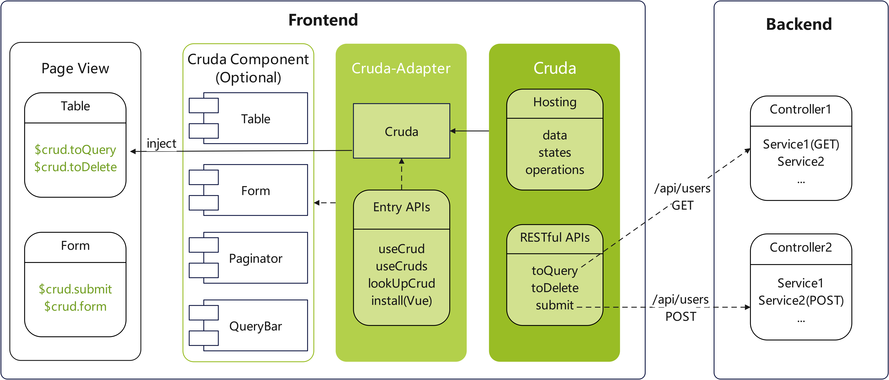

#  Cruda


一个CRUD视图模型，提供数据、状态、操作的托管如 `submit()`/`form.name`/`loading.table`，可以让开发者使用更少的代码，更快的构建CRUD视图。

Cruda通过适配器提供跨UI框架的统一接口。

## 概念图


## Demos
- [element-ui](https://stackblitz.com/edit/cruda-element-ui?file=src%2FApp.vue)
- [element-plus](https://stackblitz.com/edit/cruda-element-plus?file=src%2FApp.vue)

## 特性
- 数据托管
```html
<!-- $crud.query (查询数据) -->
<el-input v-model="$crud.query.xxx"></el-input>
<!-- $crud.table.data (列表数据) -->
<el-table v-model="$crud.table.data"></el-table>
<!-- $crud.form (表单数据) -->
<el-form :model="$crud.form"></el-form>
<!-- $crud.table.data (树形数据) -->
<el-tree :model="$crud.table.data"></el-tree>
```
- 操作托管
```js
$crud.submit(formEl) //submit form
$crud.reload() //reload table 
$crud.cancel() //cancel form
```
- 状态托管
```html
<!-- 当reload方法调用时自动设置loading -->
<button class="..." :loading="$crud.loading.query" @click="$crud.reload()">
  查询
</button>
```
- 逻辑封装
```js
/* 当调用toQuery方法时, Cruda 会
1. 设置 loading.query 为 True
2. 打包 query, pagination, order 等数据
3. 触发钩子
4. 捕获异常
5. ...
*/
$crud.toQuery()
```
- RESTful HTTP 方法
```js
$crud.toQuery() //GET
$crud.toDelete() //DELETE
$crud.doUpdate() //PUT
```
- 多UI框架支持
- 多实例支持
- ...

## 使用
### 1. 安装
- [cruda-adapter-element-ui](https://gitee.com/holyhigh2/cruda-element-ui)
- [cruda-adapter-element-plus](https://gitee.com/holyhigh2/cruda-element-plus)
### 2. 激活
- [cruda-adapter-element-ui](https://gitee.com/holyhigh2/cruda-element-ui)
- [cruda-adapter-element-plus](https://gitee.com/holyhigh2/cruda-element-plus)
### 3. 多实例
- [cruda-adapter-element-ui](https://gitee.com/holyhigh2/cruda-element-ui)
- [cruda-adapter-element-plus](https://gitee.com/holyhigh2/cruda-element-plus)
### 4. 钩子
- [cruda-adapter-element-ui](https://gitee.com/holyhigh2/cruda-element-ui)
- [cruda-adapter-element-plus](https://gitee.com/holyhigh2/cruda-element-plus)
### 5. 自定义组件
- [cruda-adapter-element-ui](https://gitee.com/holyhigh2/cruda-element-ui)
- [cruda-adapter-element-plus](https://gitee.com/holyhigh2/cruda-element-plus)
### 6. URL 参数
- [cruda-adapter-element-ui](https://gitee.com/holyhigh2/cruda-element-ui)
- [cruda-adapter-element-plus](https://gitee.com/holyhigh2/cruda-element-plus)
### 7. 全局默认值
当项目中存在通用的CRUD场景时，可以设置全局默认值/钩子/...
```ts
//rs具有哪些属性取决于后端返回值
CRUD.defaults[CRUD.HOOK.AFTER_QUERY] = function (crud, rs) {
  crud.pagination.total = rs.data.total
  crud.table.data = rs.data.records || []
}
CRUD.defaults.pagination.pageSize = 10
CRUD.defaults.view.opQuery = true
CRUD.defaults.table.rowKey = 'id'
```
### 8. RESTAPI
可以修改API地址/请求方法来适配后端服务
```js
CRUD.RESTAPI = {
  QUERY: { url: "", method: "GET" },
  ADD: { url: "", method: "POST" },
  UPDATE: { url: "", method: "PUT" },
  DELETE: { url: "", method: "DELETE" },
  EXPORT: { url: "/export", method: "GET" },
  IMPORT: { url: "/import", method: "POST" },
  SORT: { url: "/sort", method: "PUT" },
  COPY: { url: "/copy", method: "POST" },
}
```
#### 实例API (v1.9+)
也可以在激活时设置实例专用的RESTAPI
```js
const $crud = useCrud({
  url:'/api/single',
  restApi:{
    //支持对象格式或字符串格式(仅能设置url)
    ADD:{url:'/add-batch',method:'POST'},
    COPY:'/copy2'
  }
})
```
>**\*** api的key必须是大写格式
### 9. xApi (v1.5+)
`CRUD.xApi(apiName,apiUrl,config)` 可用于扩展 CRUD RESTAPI 以对业务接口进行统一管理。下面的例子演示了如何扩展一个CRUD API
```js
//1. 注册新接口（通常在系统初始化阶段调用）。注册API后，会
/**
 * a. 在crud实例中注册 toClone 方法
 * b. 在CRUD.HOOK中注册 BEFORE_CLONE、AFTER_CLONE 钩子
 */
CRUD.xApi('clone','/clone',{method:'POST'})
//2. 监听注册钩子
onHook(this,CRUD.HOOK.AFTER_CLONE,(crud,rs)=>{
  console.log('xApi-->',rs.data)
})
//3. 调用 toClone 方法
this.$crud.toClone({x:1,y:2});
```
### 10. 自动响应 (v1.8+)
通过配置`autoResponse`参数可以实现add/update/delete/copy操作的自动视图刷新，避免全部通过`reload()`操作而导致的状态丢失。一个典型的场景就是树表操作 —— 可避免因刷新而导致的层级关闭或页面闪烁。具体配置如下
```ts
//1. 设置 response 校验器，用于验证返回结果是否成功同时也表示开启自动更新
$crud.autoResponse.validator = (response:{status:number})=>{
  return response.status === 200
}
//2. autoResponse参数支持默认设置。对于 add/copy 这样的新增操作必须设置getter函数以便从后台获取具有主键的新增记录
CRUD.defaults.autoResponse.getter = (response:any)=>{
  return [response.data]
}
//2. 如果新增记录在前端获取主键，可以在getter中直接返回提交数据。对于更新操作，如果未设置getter则使用提交数据进行更新
CRUD.defaults.autoResponse.getter = (response:any,submitRows?:any[])=>{
  return submitRows
}
//3. 对于树表，新增操作还可以设置parentKeyField属性以便查找上级。默认pid
CRUD.defaults.autoResponse.parentKeyField = 'pid'
//4. 插入操作时可以指定插入位置 head 或 tail。默认head
CRUD.defaults.autoResponse.position = 'head'
//5. 对于树表，删除操作还可以设置childrenKeyField属性以便查找下级。默认children
CRUD.defaults.autoResponse.childrenKeyField = 'children'
```
之后CRUDA就会替你自动更新视图。如果想手动控制可以在 add/update/delete/copy 操作的 AFTER_XXX 钩子中调用更新方法或自行实现更新
```ts
// 其他可用钩子见下方文档
onHook(CRUD.HOOK.AFTER_DELETE,(crud,rs,rows,autoProcess)=>{
  autoProcess()
})
```


## Cruda API
### Props

- view ✅
  > 业务组件通过 view 来控制 UI
  >
  > - opQuery 查询(框/按钮/..)开关
  > - opAdd 新增按钮显示开关
  > - opEdit 编辑按钮显示开关
  > - opDel 删除按钮显示开关
  > - opExport 导出按钮显示开关
  > - opImport 导入按钮显示开关
  > - opSort 排序按钮显示开关
  > - opCopy 复制按钮显示开关
- loading
  > 通过 loading 控制锁定状态
  >
  > - query 查询按钮锁定开关
  > - table 表格锁定开关
  > - del 删除按钮锁定开关
  > - submit 提交按钮锁定开关
  > - form 表单加载锁定开关
  > - export 导出按钮锁定开关
  > - import 导入按钮锁定开关
  > - sort 排序按钮锁定开关
  > - copy 复制按钮锁定开关
- query
  > 托管查询条件的容器
- sortation
  > 托管排序结果的容器
- table
  > 表格容器托管当前 crud 实例的列表/tree 数据及显示状态
  >
  > - data 表格数据
  > - selection 当前选中行
  > - allColumns 表格所有列，用于动态展示
  > - orders 排序列表，会传递给 GET 请求
  > - rowKey✅ 表格行的 id key，默认为'id'。通常由适配器自动设置
- pagination
  > 分页容器托管当前 crud 实例的列表分页状态
  >
  > - pageSize✅ 每页记录数
  > - currentPage 当前页号
  > - total 总记录数
- form
  > 表单容器托管当前 crud 实例的表单数据
- formStatus
  > 表单当前状态 0：默认；1：新增；2：编辑；3：查看
- params
  > crud 激活参数，通过对象方式构造 crud 时可以注入。可用于自定义组件中进行附加操作，比如附加 CRUD 权限控制
- error
  > crud 错误信息{name，message，status}。可以用于监控并作出合适的反馈，比如网络超时提示
- editingId
  > 当前正在编辑器的表单行id，根据`table.rowKey`属性确定
- key
  > 多实例下每个crud实例的标识
- recoverable✅⚡
  > 是否开启编辑快照，开启后会在新增/编辑时保存form快照
- snapshots
  > 保存快照内容的对象，key是table.row的id。可用于在视图中显示快照状态，详见examples
- invalidBreak✅⚡
  > 表单校验检测到首个无效信息时中断校验
- autoResponse✅⚡
  > 在表单提交 add/update/delete/copy操作后，自动更新`crud.table.data`视图
- defaultQuery⚡
  > 默认查询参数，GET请求时自动合并到请求参数中
- restApi⚡
  > 实例api，可覆盖 `8. RESTAPI`

✅ **_表示支持全局默认值_**  ⚡ **_表示支持对象激活参数_**

### Methods

- toQuery(query?: Record<string, any>) : Promise
  > 启动 crud 实例的查询。向指定 REST 地址发送 GET 请求。query参数会与$crud.query进行[merge](https://holyhigh2.github.io/func.js/api/modules/object#merge)但不会修改$crud.query
- toDelete(rows: Record<string, unknown> | Record<string, unknown>[]) : Promise
  > 启动 crud 实例的删除。向指定 REST 地址发送 DELETE _**(默认)**_ 请求
- toExport() : Promise
  > 启动 crud 实例的导出。向指定 REST 地址发送 GET _**(默认)**_ 请求
- toImport(file: File | File[],fieldName?: string) : Promise
  > 启动 crud 实例的导入。fieldName可指定服务端接收名称，如果为空，当file为单个对象时默认为`file`,当file为数组时默认为`files`。向指定 REST 地址发送 POST _**(默认)**_ 请求
- toAdd(...args)
  > 设置 form 状态为新增。
- toEdit(row) : Promise
  > 设置 form 状态为编辑。向指定 REST 地址发送 GET _**(默认)**_ 请求
- toView(row) : Promise
  > 设置 form 状态为查看。向指定 REST 地址发送 GET _**(默认)**_ 请求
- toSort() : Promise
  > 启动 crud 实例的排序。向指定 REST 地址发送 PUT _**(默认)**_ 请求
- toCopy() : Promise
  > 启动 crud 实例的复制。向指定 REST 地址发送 POST _**(默认)**_ 请求
- cancel()
  > 设置 form 状态为取消。
- submit(...args) : Promise
  > args参数会传递给 `BEFORE_SUBMIT` 并可自行实现校验逻辑
- submitAdd(...args) : Promise
  > 同`submit()`，但不会校验`formStatus`
- submitEdit(...args) : Promise
  > 同`submit()`，但不会校验`formStatus`
- submitForm(form, ...args)
  > **_*依赖适配器_**。可以对1或多个表单(或具有validate()方法的组件)进行校验，并在通过后调用`submit()`  
- reload(query?: Record<string, any>) : Promise
  > 重置分页信息并执行一次 toQuery()
- getRestURL() : string
  > 获取 crud 实例的服务地址。通常用于 crud 内部
- setURLParams(paramObj)
  > 设置服务地址中的参数表
- getDetails(rowId) : Promise
  > 获取行信息。通常用于 crud 内部
- changeSelection(selection: Record<string, any>[])
  > 用在 table 的 selection-change 事件中，记录 table 当前已选记录
- changeOrder(sortData: {
  column: Record<string, any>
  prop: string
  order: string | null
  })
  > 用在 table 的 sort-change 事件，会自动管理排序信息并触发查询
- getContext()
  > 获取crud实例所在的上下文

### HOOKs

- BEFORE_QUERY(crud,params,orders,cancel) _**async**_
  > 查询前回调，可以修改请求参数(params)，比如分页名称等，可取消。取消后不会触发 AFTER_QUERY  
  > **注意** ,params 为提交接口的实际对象（包含 query、pagination)，此处修改 crud.query/pagination 的内容不会提交到接口
- AFTER_QUERY(crud,rs) _**async**_
  > 查询后回调，可以获取查询结果，设置表格
- BEFORE_DELETE(crud,rows,cancel) _**async**_
  > 删除前调用，可取消。取消后不会触发 AFTER_DELETE
- AFTER_DELETE(crud,rs,rows,autoProcess) _**async**_
  > 删除后调用. `autoProcess()` 用来自动更新视图
- BEFORE_ADD(crud,cancel,...args) _**async**_
  > 新增前调用，可以用来清空表单或产生 uuid 等。可取消，取消后表单状态不变。*...args* 来自`toAdd()`
- AFTER_ADD(crud,rs,autoProcess) _**async**_
  > 新增提交后 `AFTER_SUBMIT`前调用. `autoProcess()` 用来自动更新视图
- BEFORE_EDIT(crud,row,cancel,skip) _**async**_
  > 编辑前调用，可以用来锁定某些字段。可取消，取消后表单状态不变; `skip()`用来跳过记录详情查询，跳过后不会触发 AFTER_DETAILS 
- AFTER_UPDATE(crud,rs,autoProcess) _**async**_
  > 编辑提交后 `AFTER_SUBMIT`前调用. `autoProcess()` 用来自动更新视图
- BEFORE_VIEW(crud,row,cancel,skip) _**async**_
  > 查看前调用，可以用来对显示内容进行格式化等。可取消，取消后表单状态不变; `skip()`用来跳过记录详情查询，跳过后不会触发 AFTER_DETAILS 
- AFTER_DETAILS(crud,rs) _**async**_
  > 编辑/查看(默认)开启详情查询后触发
- AFTER_DETAILS_EDIT(crud,rs) _**async**_
  > 编辑开启详情查询后触发，在`AFTER_DETAILS`之后
- AFTER_DETAILS_VIEW(crud,rs) _**async**_
  > 查看(默认)开启详情查询后触发，在`AFTER_DETAILS`之后
- BEFORE_SUBMIT(crud,cancel,setForm,...args) _**async**_
  > 提交前调用，可对 form 进行最后加工，可取消。取消后不会触发 `AFTER_SUBMIT`。`setForm(formObject)`用于设置提交到后台的form数据，默认`crud.form`
- AFTER_SUBMIT(crud,rs,autoProcess) _**async**_
  > 提交后调用，可以用来刷新页面、发送通知或其他操作. `autoProcess()` 用来自动更新视图
- BEFORE_EXPORT(crud,params,orders,cancel) _**async**_
  > 导出前调用，同 BEFORE_QUERY，可取消。取消后不会触发 AFTER_EXPORT
- AFTER_EXPORT(crud,rs) _**async**_
  > 获取导出数据后调用
  > 表单取消编辑时触发（调用 cancel 后）
- BEFORE_IMPORT(crud,params,file,cancel) _**async**_
  > 导入文件上传前调用，可在 params 中添加额外参数，当file是数组时可修改上传数量；可取消。取消后不会触发 AFTER_IMPORT；
- AFTER_IMPORT(crud,rs) _**async**_
  > 导入上传完成后调用
- BEFORE_SORT(crud,sortation,cancel) _**async**_
  > 排序前调用，可用来打开排序框或启动自动排序处理，可取消。取消后不会触发 AFTER_SORT
- AFTER_SORT(crud,rs) _**async**_
  > 提交排序后调用，可以用来刷新页面、发送通知或其他操作
- BEFORE_COPY(crud,rows,cancel) _**async**_
  > 复制记录前调用，可取消。取消后不会触发 AFTER_COPY
- AFTER_COPY(crud,rs,rows,autoProcess) _**async**_
  > 复制完成后调用. `autoProcess()` 用来自动更新视图
- ON_ERROR(crud,error)
  > 操作发生错误时调用
- ON_CANCEL(crud)
  > 操作发生错误时调用
- ON_VALIDATE(crud,isValid,invalidFields)
  > 调用submitForm时触发
- BEFORE_RECOVER(crud,cancel,snapshot) _**async**_
  > 恢复快照前调用

## 错误信息

- Must specify 'crudName' when multiple instances detected
  > 多实例时调用 lookUpCrud 方法未指定 crud 标识。解决方法见【6. 自定义组件】
- form validation Xxx
  > 表单提交时验证错误信息
- Cannot find [request] in the installation options
  > 安装时未指定请求器。解决方法见【1. 安装】
- table.rowKey is a blank value 'Xxx', it may cause an error - toDelete/Edit/View()
  > 进行删除/编辑/查看操作时未指定 table.rowKey。可以设置默认/$crud 实例的对应属性

## 工作流图

